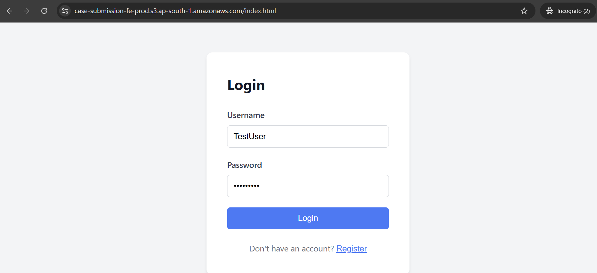
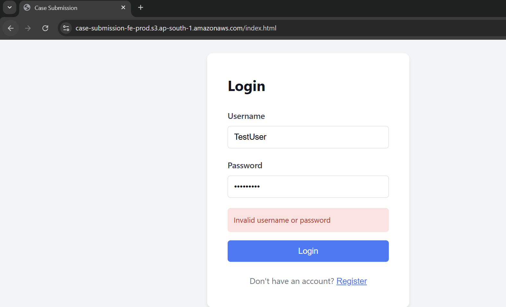
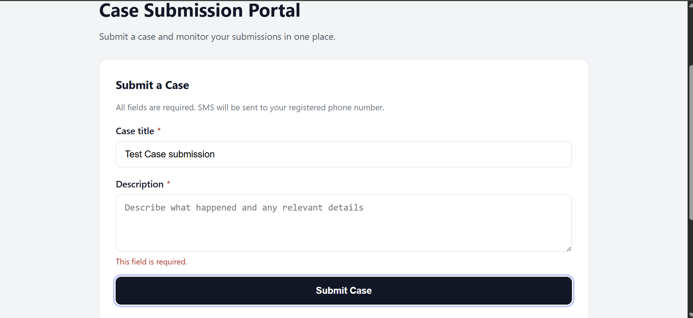
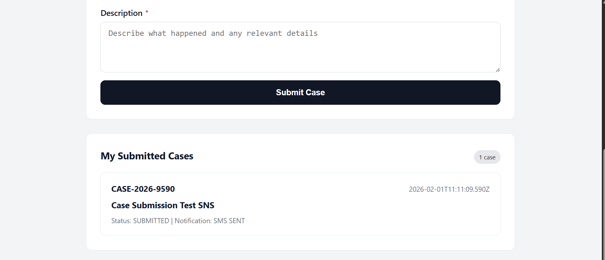
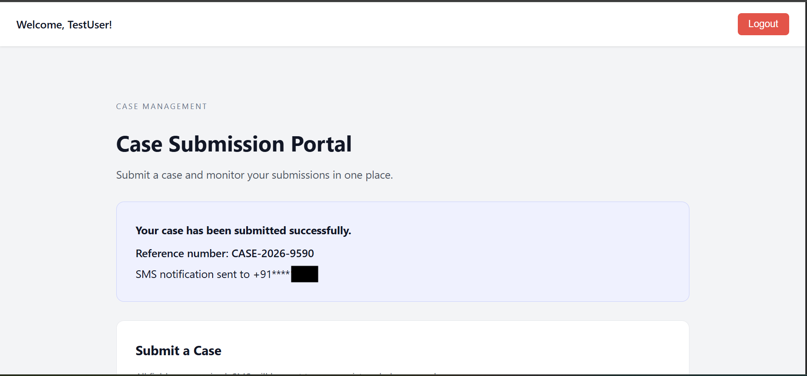
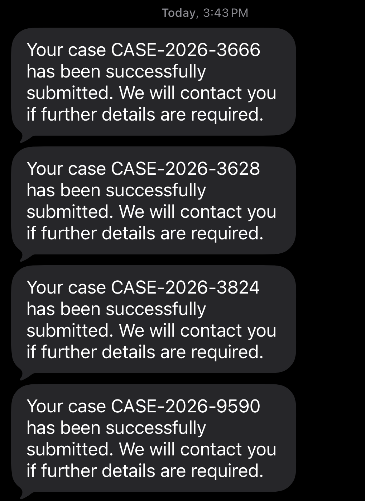

# Case Submission Application

A production-ready full-stack application for submitting and managing customer support cases with SMS notifications, user authentication, and serverless deployment on AWS.

---

## Table of Contents

- [Overview](#overview)
- [Features](#features)
- [Screenshots](#screenshots)
- [Architecture](#architecture)
- [Tech Stack](#tech-stack)
- [Database Schema](#database-schema)
- [Getting Started](#getting-started)
- [Local Development](#local-development)
- [Testing](#testing)
- [Production Deployment](#production-deployment)
- [API Documentation](#api-documentation)
- [Security](#security)
- [Project Structure](#project-structure)
- [Future Enhancements](#future-enhancements)
- [Contributing](#contributing)
- [License](#license)

---

## Overview

The Case Submission Application is a modern, secure platform that enables users to submit and manage customer support cases. Built with React and Node.js, it features JWT-based authentication, real-time SMS notifications, and seamless deployment to AWS Lambda and DynamoDB.

### Key Highlights
- Secure user authentication with JWT tokens
- Automatic SMS notifications via AWS SNS
- Serverless architecture on AWS (Lambda + DynamoDB)
- Clean, responsive React UI
- Comprehensive test coverage (127 passing tests)
- User-specific case management
- Real-time case status tracking

---

## Features

### User Management
- **Secure Registration & Login**: Password hashing with bcrypt (10 rounds)
- **JWT Authentication**: 7-day token expiration with secure token storage
- **User Isolation**: Each user can only view and manage their own cases

### Case Management
- **Create Cases**: Submit support cases with title and description
- **Auto-Generated Reference Numbers**: Format: `CASE-YYYY-XXXX`
- **Status Tracking**: Real-time case status updates
- **User Dashboard**: View all submitted cases in one place

### SMS Notifications
- **Automatic Alerts**: SMS sent immediately upon case submission
- **Multi-Provider Support**: Mock (dev), AWS SNS (production)
- **Privacy Protection**: Phone numbers masked in logs
- **Resilient Design**: SMS failures don't block case creation

### Security
- Rate limiting on authentication endpoints
- Schema validation with Zod (rejects unknown fields)
- Centralized error handling
- Secure password storage
- Token-based API authentication

---

## Screenshots

### Login Page



### Registration Page


### Submit New Case





### Case Successfully Submitted


### SMS Notifications
The system automatically sends SMS notifications when cases are submitted. SMS is handled via AWS SNS or mock provider for development.



---

## Architecture

The application follows a clean, layered architecture pattern:

```
┌─────────────┐
│   Client    │  React + Vite
│  (Browser)  │
└──────┬──────┘
       │ HTTPS
       ▼
┌─────────────────────────────┐
│     API Gateway (REST)       │  AWS
└──────┬──────────────────────┘
       │
       ▼
┌─────────────────────────────┐
│   Lambda Functions          │
│ ┌─────────┬─────────────┐  │
│ │Register │   Login     │  │
│ │Create   │   List      │  │
│ └─────────┴─────────────┘  │
└──────┬──────────────────────┘
       │
       ├─────────────┬──────────────┐
       ▼             ▼              ▼
┌──────────┐  ┌──────────┐  ┌──────────┐
│DynamoDB  │  │DynamoDB  │  │AWS SNS   │
│(Users)   │  │(Cases)   │  │(SMS)     │
└──────────┘  └──────────┘  └──────────┘
```

### Request Flow
1. **Client**: User interacts with React UI
2. **API Gateway**: Routes requests to appropriate Lambda function
3. **Lambda**: Executes business logic (Controller → Service → Repository)
4. **DynamoDB**: Stores/retrieves user and case data
5. **SNS**: Sends SMS notifications (async, non-blocking)

---

## Tech Stack

### Frontend
- **Framework**: React 18
- **Build Tool**: Vite
- **Styling**: CSS3
- **HTTP Client**: Fetch API
- **Testing**: Vitest + React Testing Library

### Backend
- **Runtime**: Node.js 18.x
- **Framework**: Express.js
- **Validation**: Zod
- **Authentication**: JWT (jsonwebtoken)
- **Password Hashing**: bcrypt
- **Testing**: Jest

### Database
- **Local Development**: SQLite3
- **Production**: AWS DynamoDB
  - PAY_PER_REQUEST billing mode
  - Global Secondary Indexes for efficient queries

### Cloud Infrastructure (AWS)
- **Compute**: Lambda Functions (Node.js 18.x runtime)
- **API**: API Gateway (REST API)
- **Storage**: DynamoDB (NoSQL)
- **SMS**: SNS (Simple Notification Service)
- **Hosting**: S3 + CloudFront (frontend static hosting)
- **IAM**: Fine-grained access control

### Development Tools
- Git for version control
- ESLint for code quality
- Jest & Vitest for testing
- AWS CLI for deployments

---

## Database Schema

### Users Table

| Field | Type | Description |
|-------|------|-------------|
| `id` | UUID | Primary key |
| `username` | String | Unique username (3-50 chars) |
| `password_hash` | String | Bcrypt hashed password |
| `created_at` | Timestamp | Account creation time |

**DynamoDB Keys:**
- Hash Key: `username`
- GSI: `UserIdIndex` on `id`

### Cases Table

| Field | Type | Description |
|-------|------|-------------|
| `id` | UUID | Case identifier |
| `user_id` | UUID | Foreign key to users |
| `reference_number` | String | Human-readable (CASE-YYYY-XXXX) |
| `title` | String | Case title |
| `description` | String | Case description |
| `status` | Enum | SUBMITTED, IN_PROGRESS, RESOLVED |
| `sms_status` | Enum | PENDING, SENT, FAILED |
| `created_at` | Timestamp | Case creation time |

**DynamoDB Keys:**
- Hash Key: `userId`
- Range Key: `id`

---

## Getting Started

### Prerequisites
- Node.js 18.x or higher
- npm or yarn
- Git
- AWS Account (for production deployment)
- AWS CLI (for deployment)

### Quick Start

```bash
# Clone the repository
git clone <your-gitlab-repo-url>
cd case-submission-app

# Install backend dependencies
cd server
npm install

# Install frontend dependencies
cd ../client
npm install
```

---

## Local Development

### 1. Backend Setup

```bash
cd server

# Create environment file
cp .env.example .env

# Edit .env and set:
# - JWT_SECRET=your-secret-key-here
# - SMS_PROVIDER=mock
# - NODE_ENV=development

# Start development server
npm run dev
```

Server runs at `http://localhost:4000`

### 2. Frontend Setup

```bash
cd client

# Create environment file (optional)
echo "VITE_API_URL=http://localhost:4000" > .env.development

# Start development server
npm run dev
```

Client runs at `http://localhost:5173`

### 3. Test the Application

#### Register a User
```bash
curl -X POST http://localhost:4000/api/auth/register \
  -H "Content-Type: application/json" \
  -d '{"username":"testuser","password":"password123"}'
```

Response:
```json
{
  "token": "eyJhbGc...",
  "user": {
    "id": "uuid-here",
    "username": "testuser"
  },
  "message": "User registered successfully"
}
```

#### Submit a Case
```bash
curl -X POST http://localhost:4000/api/cases \
  -H "Content-Type: application/json" \
  -H "Authorization: Bearer YOUR_TOKEN" \
  -d '{
    "title": "Login Issue",
    "description": "Cannot access my account after password reset"
  }'
```

#### List Cases
```bash
curl http://localhost:4000/api/cases \
  -H "Authorization: Bearer YOUR_TOKEN"
```

---

## Testing

### Backend Tests

```bash
cd server
npm test

# With coverage
npm run test:coverage
```

**Test Coverage:**
- 83 passing tests
- Controllers, Services, Repositories
- Middleware, Utilities, Validation

### Frontend Tests

```bash
cd client
npm test

# With coverage
npm run test:coverage
```

**Test Coverage:**
- 44 passing tests
- Components, API clients, Utilities
- Integration and unit tests

---

## Production Deployment

The application is designed for serverless deployment on AWS. Follow these steps for production deployment:

### Prerequisites
- AWS CLI configured with appropriate credentials
- IAM permissions for DynamoDB, Lambda, API Gateway, S3, IAM, SNS
- Node.js 18.x installed locally

### Deployment Overview

1. **DynamoDB Tables**: Create users and cases tables
2. **IAM Role**: Create Lambda execution role
3. **Lambda Layer**: Deploy shared dependencies
4. **Lambda Functions**: Deploy 4 functions (register, login, create, list)
5. **API Gateway**: Create REST API and configure routes
6. **S3 Frontend**: Build and deploy React app

### Automated Deployment

```bash
cd deploy

# 1. Configure environment
cp prod.env.example prod.env
# Edit prod.env with your AWS credentials and settings

# 2. Run deployment script
./deploy-prod.sh
```

This script will:
- Verify AWS credentials
- Create DynamoDB tables (if not exists)
- Create IAM role with policies
- Package and deploy Lambda layer
- Package and deploy Lambda functions
- Create and configure API Gateway
- Build and deploy frontend to S3
- Configure S3 for static website hosting

### Manual Deployment

For step-by-step manual deployment instructions, see the detailed commands below.

<details>
<summary><strong>Click to expand: Manual Deployment Steps</strong></summary>

#### 1. Create DynamoDB Tables

**Cases Table:**
```bash
aws dynamodb create-table \
  --table-name case-submission-prod-cases \
  --attribute-definitions \
    AttributeName=userId,AttributeType=S \
    AttributeName=id,AttributeType=S \
  --key-schema \
    AttributeName=userId,KeyType=HASH \
    AttributeName=id,KeyType=RANGE \
  --billing-mode PAY_PER_REQUEST \
  --region ap-south-1
```

**Users Table:**
```bash
aws dynamodb create-table \
  --table-name case-submission-prod-users \
  --attribute-definitions \
    AttributeName=username,AttributeType=S \
    AttributeName=id,AttributeType=S \
  --key-schema \
    AttributeName=username,KeyType=HASH \
  --global-secondary-indexes \
    '[{"IndexName":"UserIdIndex","KeySchema":[{"AttributeName":"id","KeyType":"HASH"}],"Projection":{"ProjectionType":"ALL"}}]' \
  --billing-mode PAY_PER_REQUEST \
  --region ap-south-1
```

#### 2. Create IAM Role

```bash
aws iam create-role \
  --role-name case-submission-lambda-role \
  --assume-role-policy-document '{
    "Version": "2012-10-17",
    "Statement": [{
      "Effect": "Allow",
      "Principal": {"Service": "lambda.amazonaws.com"},
      "Action": "sts:AssumeRole"
    }]
  }'

aws iam attach-role-policy \
  --role-name case-submission-lambda-role \
  --policy-arn arn:aws:iam::aws:policy/service-role/AWSLambdaBasicExecutionRole
```

#### 3. Create Lambda Layer

```bash
mkdir -p /tmp/case-submission-layer/nodejs
cd /tmp/case-submission-layer/nodejs
npm init -y
npm install zod bcryptjs jsonwebtoken uuid --production

cd /tmp/case-submission-layer
zip -r layer.zip .

aws lambda publish-layer-version \
  --layer-name case-submission-shared-layer \
  --zip-file fileb:///tmp/case-submission-layer/layer.zip \
  --compatible-runtimes nodejs18.x \
  --region ap-south-1
```

#### 4. Deploy Lambda Functions

```bash
cd server/src
zip -r /tmp/case-submission-lambda.zip . -x "*.test.js" -x "coverage/*" -x "local/*"

# Create each function
for func in register login createCase listCases; do
  aws lambda create-function \
    --function-name case-submission-${func}-prod \
    --runtime nodejs18.x \
    --role arn:aws:iam::YOUR_ACCOUNT_ID:role/case-submission-lambda-role \
    --handler lambda/${func}.handler \
    --zip-file fileb:///tmp/case-submission-lambda.zip \
    --layers YOUR_LAYER_ARN \
    --environment Variables="{DYNAMODB_TABLE_PREFIX=case-submission-prod,JWT_SECRET=YOUR_SECRET,SMS_PROVIDER=sns}" \
    --timeout 30 \
    --region ap-south-1
done
```

#### 5. Set Up API Gateway

Use AWS Console or CLI to:
- Create REST API
- Create resources: `/auth/register`, `/auth/login`, `/cases`
- Configure Lambda integrations
- Enable CORS
- Deploy to `prod` stage

#### 6. Deploy Frontend

```bash
cd client
echo "VITE_API_URL=https://YOUR_API_GATEWAY_URL/prod" > .env.production
npm run build

aws s3api create-bucket \
  --bucket case-submission-fe-prod \
  --region ap-south-1 \
  --create-bucket-configuration LocationConstraint=ap-south-1

aws s3api put-bucket-website \
  --bucket case-submission-fe-prod \
  --website-configuration '{
    "IndexDocument": {"Suffix": "index.html"},
    "ErrorDocument": {"Key": "index.html"}
  }'

aws s3 sync dist/ s3://case-submission-fe-prod/ --delete
```

</details>

### Post-Deployment Verification

```bash
# Test API endpoint
curl https://YOUR_API_GATEWAY_URL/prod/health

# Test registration
curl -X POST https://YOUR_API_GATEWAY_URL/prod/api/auth/register \
  -H "Content-Type: application/json" \
  -d '{"username":"prod-test","password":"SecurePass123"}'
```

---

## API Documentation

### Base URL
- **Local**: `http://localhost:4000`
- **Production**: `https://YOUR_API_GATEWAY_URL/prod`

### Authentication Endpoints

#### Register User
```http
POST /api/auth/register
Content-Type: application/json

{
  "username": "john_doe",
  "password": "SecurePassword123"
}
```

**Response (201):**
```json
{
  "token": "eyJhbGciOiJIUzI1NiIsInR5cCI6IkpXVCJ9...",
  "user": {
    "id": "550e8400-e29b-41d4-a716-446655440000",
    "username": "john_doe"
  },
  "message": "User registered successfully"
}
```

#### Login User
```http
POST /api/auth/login
Content-Type: application/json

{
  "username": "john_doe",
  "password": "SecurePassword123"
}
```

**Response (200):**
```json
{
  "token": "eyJhbGciOiJIUzI1NiIsInR5cCI6IkpXVCJ9...",
  "user": {
    "id": "550e8400-e29b-41d4-a716-446655440000",
    "username": "john_doe"
  }
}
```

### Case Management Endpoints

#### Create Case
```http
POST /api/cases
Authorization: Bearer <token>
Content-Type: application/json

{
  "title": "Login Issue",
  "description": "Unable to login after password reset"
}
```

**Response (201):**
```json
{
  "id": "660e8400-e29b-41d4-a716-446655440001",
  "userId": "550e8400-e29b-41d4-a716-446655440000",
  "referenceNumber": "CASE-2026-0001",
  "title": "Login Issue",
  "description": "Unable to login after password reset",
  "status": "SUBMITTED",
  "smsStatus": "SENT",
  "createdAt": "2026-02-01T10:30:00.000Z"
}
```

#### List User Cases
```http
GET /api/cases
Authorization: Bearer <token>
```

**Response (200):**
```json
[
  {
    "id": "660e8400-e29b-41d4-a716-446655440001",
    "referenceNumber": "CASE-2026-0001",
    "title": "Login Issue",
    "description": "Unable to login after password reset",
    "status": "SUBMITTED",
    "createdAt": "2026-02-01T10:30:00.000Z"
  }
]
```

### Error Responses

```json
{
  "error": "Error message here"
}
```

**Status Codes:**
- `200` - Success
- `201` - Created
- `400` - Bad Request (validation error)
- `401` - Unauthorized (invalid/missing token)
- `409` - Conflict (username already exists)
- `500` - Internal Server Error

---

## Security

### Authentication & Authorization
- **JWT Tokens**: 7-day expiration, HS256 algorithm
- **Password Security**: bcrypt with 10 salt rounds
- **Token Storage**: localStorage (client-side)
- **Protected Routes**: All case endpoints require valid JWT

### Input Validation
- **Zod Schema Validation**: Strict type checking
- **Unknown Field Rejection**: Extra fields in requests are rejected
- **Username Rules**: 3-50 characters, alphanumeric + underscore
- **Password Rules**: Minimum 6 characters (configurable)

### Rate Limiting
- Authentication endpoints: Limited requests per IP
- Case submission: Prevents spam attacks
- Configurable thresholds

### Data Protection
- **Phone Number Masking**: Logs show `***1234` format
- **Password Hashing**: Never stored in plain text
- **Error Handling**: Generic error messages (no internal details leaked)
- **CORS Configuration**: Restricted origins in production

### AWS Security
- **IAM Roles**: Least privilege principle
- **Lambda Execution**: Isolated runtime environment
- **DynamoDB**: Encrypted at rest
- **API Gateway**: HTTPS only in production

---

## Project Structure

```
case-submission-app/
│
├── client/                    # Frontend React application
│   ├── src/
│   │   ├── api/              # API client functions
│   │   │   ├── authApi.js    # Authentication API calls
│   │   │   └── casesApi.js   # Cases API calls
│   │   ├── components/       # Reusable React components
│   │   │   ├── AuthForm.jsx  # Login/Register form
│   │   │   ├── CaseForm.jsx  # Case submission form
│   │   │   └── CaseList.jsx  # Case list display
│   │   ├── pages/            # Page components
│   │   │   └── Home.jsx      # Main dashboard page
│   │   ├── utils/            # Utility functions
│   │   │   └── token.js      # Token management
│   │   ├── App.jsx           # Root component
│   │   ├── main.jsx          # Entry point
│   │   └── styles.css        # Global styles
│   ├── tests/                # Frontend tests
│   ├── index.html            # HTML template
│   ├── package.json          # Dependencies
│   └── vite.config.js        # Vite configuration
│
├── server/                    # Backend Node.js application
│   ├── src/
│   │   ├── auth/             # Authentication module
│   │   │   ├── auth.controller.js  # Auth request handlers
│   │   │   └── auth.service.js     # Auth business logic
│   │   ├── cases/            # Cases module
│   │   │   ├── cases.controller.js  # Case request handlers
│   │   │   ├── cases.service.js     # Case business logic
│   │   │   ├── cases.repository.js  # Database access
│   │   │   └── cases.validation.js  # Zod schemas
│   │   ├── users/            # Users module
│   │   │   └── users.repository.js  # User database access
│   │   ├── sms/              # SMS notification module
│   │   │   ├── sms.service.js       # SMS orchestration
│   │   │   └── providers/
│   │   │       ├── mock.provider.js  # Mock SMS (dev)
│   │   │       └── sns.provider.js   # AWS SNS (prod)
│   │   ├── lambda/           # Lambda function handlers
│   │   │   ├── register.js   # User registration
│   │   │   ├── login.js      # User login
│   │   │   ├── createCase.js # Create case
│   │   │   ├── listCases.js  # List cases
│   │   │   └── shared.js     # Shared Lambda utilities
│   │   ├── middleware/       # Express middleware
│   │   │   ├── errorHandler.js  # Centralized error handling
│   │   │   └── rateLimit.js     # Rate limiting
│   │   ├── config/           # Configuration
│   │   │   └── env.js        # Environment variables
│   │   ├── utils/            # Utilities
│   │   │   ├── logger.js     # Winston logger
│   │   │   └── token.js      # JWT utilities
│   │   ├── app.js            # Express app setup
│   │   ├── server.js         # HTTP server (local dev)
│   │   └── lambda.js         # Lambda entry point
│   ├── local/                # Local development files
│   │   └── cases.sqlite      # SQLite database (git-ignored)
│   ├── tests/                # Backend tests
│   ├── package.json          # Dependencies
│   └── jest.config.json      # Jest configuration
│
├── docs/                      # Documentation
│   └── screenshots/          # Application screenshots
│       ├── login/            # Login page screenshots
│       ├── register/         # Registration page screenshots
│       ├── list/             # Case list screenshots
│       ├── submit-case/      # Submit case form screenshots
│       └── success/          # Success message screenshots
│
├── .gitignore                # Git ignore rules
└── README.md                 # This file
```

### Module Responsibilities

#### Controllers
- Handle HTTP requests/responses
- Input validation with Zod
- Call service layer
- Return appropriate status codes

#### Services
- Business logic implementation
- Orchestrate multiple repositories
- Handle SMS notifications
- Transaction management

#### Repositories
- Database abstraction layer
- Support both SQLite and DynamoDB
- Raw queries and data mapping

---

## Future Enhancements

Planned features and improvements for upcoming releases:

### Version 2.0
- **Case Assignment**: Assign cases to support agents
- **Case Priority Levels**: Add priority (Low, Medium, High, Urgent)
- **Case Comments**: Add internal notes and customer replies
- **Email Notifications**: Alternative to SMS notifications
- **File Attachments**: Allow users to attach screenshots/documents

### Version 2.5
- **Admin Dashboard**: Analytics and case management panel
- **Case Status Updates**: Track progress (Submitted → In Progress → Resolved → Closed)
- **Search & Filters**: Advanced search by status, date, keyword
- **User Profiles**: View and edit user information
- **Dark Mode**: Toggle between light and dark themes

### Version 3.0
- **Multi-language Support**: Internationalization (i18n)
- **Real-time Updates**: WebSocket integration for live notifications
- **Case Categories**: Organize by department (Technical, Billing, General)
- **SLA Tracking**: Service level agreement monitoring
- **Export Reports**: Download cases as PDF/CSV
- **Mobile Apps**: Native iOS and Android applications

### Long-term Roadmap
- **AI-powered Responses**: Suggest solutions based on case history
- **Live Chat Integration**: Real-time customer support
- **Knowledge Base**: Self-service help articles
- **Multi-tenant Support**: Support multiple organizations
- **Advanced Analytics**: Charts, trends, and insights

---

## Contributing

We welcome contributions! Please follow these guidelines:

### Development Workflow

1. **Fork the repository**
2. **Create a feature branch**
   ```bash
   git checkout -b feature/your-feature-name
   ```
3. **Make your changes**
   - Follow existing code style
   - Add tests for new features
   - Update documentation
4. **Run tests**
   ```bash
   cd server && npm test
   cd client && npm test
   ```
5. **Commit your changes**
   ```bash
   git commit -m "feat: add new feature"
   ```
6. **Push to your fork**
   ```bash
   git push origin feature/your-feature-name
   ```
7. **Create a Pull Request**

### Commit Message Format
- `feat:` New feature
- `fix:` Bug fix
- `docs:` Documentation changes
- `test:` Adding tests
- `refactor:` Code refactoring
- `chore:` Maintenance tasks

### Code Style
- Use ESLint for JavaScript
- Follow existing patterns
- Write meaningful comments
- Keep functions small and focused

---

## License

This project is licensed under the MIT License.

```
MIT License

Copyright (c) 2026 Shanmathi

Permission is hereby granted, free of charge, to any person obtaining a copy
of this software and associated documentation files (the "Software"), to deal
in the Software without restriction, including without limitation the rights
to use, copy, modify, merge, publish, distribute, sublicense, and/or sell
copies of the Software, and to permit persons to whom the Software is
furnished to do so, subject to the following conditions:

The above copyright notice and this permission notice shall be included in all
copies or substantial portions of the Software.

THE SOFTWARE IS PROVIDED "AS IS", WITHOUT WARRANTY OF ANY KIND, EXPRESS OR
IMPLIED, INCLUDING BUT NOT LIMITED TO THE WARRANTIES OF MERCHANTABILITY,
FITNESS FOR A PARTICULAR PURPOSE AND NONINFRINGEMENT. IN NO EVENT SHALL THE
AUTHORS OR COPYRIGHT HOLDERS BE LIABLE FOR ANY CLAIM, DAMAGES OR OTHER
LIABILITY, WHETHER IN AN ACTION OF CONTRACT, TORT OR OTHERWISE, ARISING FROM,
OUT OF OR IN CONNECTION WITH THE SOFTWARE OR THE USE OR OTHER DEALINGS IN THE
SOFTWARE.
```

---

## Support & Contact

- **Developer**: Shanmathi
- **Documentation**: See project README for detailed guides

---

## Acknowledgments

- React team for the amazing framework
- AWS for serverless infrastructure
- All contributors and testers

---

<div align="center">

**[Back to top](#case-submission-application)**


</div>
